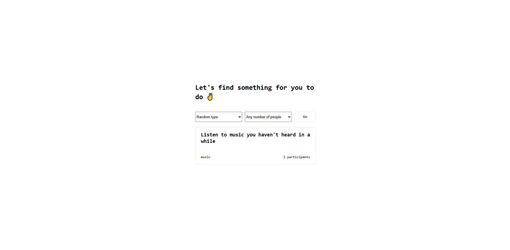

# Are you bored ?

[]()

**ENGLISH VERSION** – Are you bored ? Is a simple and fun web application that gives you random activity ideas when you're feeling bored. Whether you're alone, with friends, indoors or out, just click a button and discover something new to do!

## ✨ Features

- **Random Activity Generator**: Click a button to instantly receive a new idea.
- **Simple and Clean UI**: Designed with user-friendliness and clarity in mind.
- **Fully Responsive**: Works great on mobile phones, tablets, and desktops.
- **Quick Setup**: Minimal configuration needed to get started.

## 🛠️ Technologies Used

### Backend:

- Node.js
- Express

### Frontend:

- EJS (Embedded JavaScript Templates)
- CSS (custom styling)
- JavaScript (for interactivity)

## 🚀 Installation

1. **Clone the repository:**

   ```bash
   git clone https://github.com/Antoinekoe/bored.git
   cd boredom-buster
   ```

2. **Install the dependencies:**

   ```bash
   npm install
   ```

3. **Start the server:**

   ```bash
   node index.js
   ```

4. **Access the application:**

   Open your browser and go to `http://localhost:3000` or the port specified in your `index.js`.

## 🗂️ Project Structure

```
boredom-buster/
├── public/
│   └── styles/
│       └── main.css          # Main CSS file for styling
├── views/
│   └── index.ejs             # Main EJS view rendered by Express
├── index.js                  # Application entry point (Express server)
├── LICENSE                   # Project license (MIT or other)
├── package.json              # npm configuration
├── package-lock.json         # Dependency lock file
└── README.md                 # Project documentation
```

## 💡 How It Works

- When the user accesses the site, the server renders `index.ejs`.
- A button on the page triggers a script that fetches or selects a random activity idea.
- The activity is then displayed dynamically on the page.

## 🌱 Future Improvements

- Add categories (solo, group, indoor, outdoor).
- Allow users to submit their own boredom-busting ideas.
- Add animations and sound effects for a more engaging experience.

## 🔑 License

This project is licensed under the MIT License.
